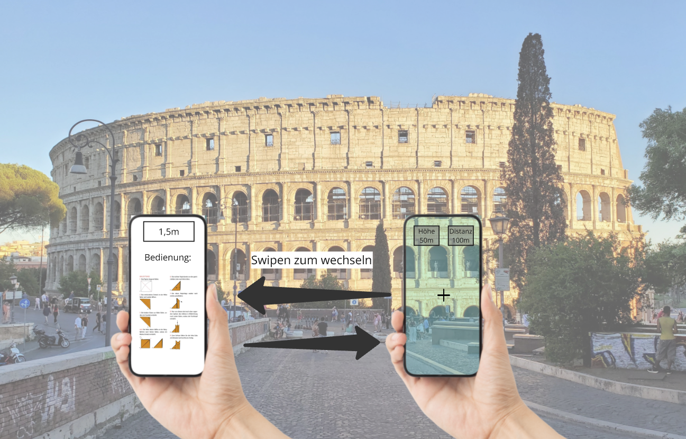

# Vor Absprache (deprecated)

## **App-Name**: PeakMeasure  

## **App-Beschreibung**  
PeakMeasure ist eine App zur Messung von Höhen und Entfernungen mithilfe der Kamera und des Neigungssensors eines mobilen Geräts. Die App nutzt die Kamera-Vorschau als zentrales Element und zeigt über ein Overlay Messwerte an. Der Benutzer kann eine manuelle Anpassung des Bodenabstands vornehmen, indem er auf den entsprechenden Wert tippt und eine neue Zahl eingibt. Außerdem werden erfasste Höhen in einer JSON-Datei gespeichert.

## **Nutzungsorientierung**  
- Die App wird primär im **Hochformat** genutzt.  
- Die UI ist für eine **einhändige Bedienung** optimiert.  

---

## **Hauptbildschirm**  
### **Allgemeine Struktur**  
Die App besteht aus einer einzigen Ansicht, die in folgende Bereiche unterteilt ist:  
1. **Kameravorschau** (Hintergrund, nimmt den gesamten Bildschirm ein).  
2. **Overlay mit Messwerten und Bedienelementen**:
   - Fadenkreuz zur Zielerfassung.  
   - Anzeigen für Höhe und Distanz.  
   - Button zur Messdatenerfassung.  
   - Manuelle Eingabe für Bodenabstand.  

### **Widgets & UI-Elemente (Kivy-kompatibel)**  
| Bereich | Kivy-Widget | Beschreibung |
|---------|------------|--------------|
| **Kameravorschau** | `Camera` | Zeigt das Livebild der Kamera an. |
| **Fadenkreuz** | `Image` oder `Widget` mit `canvas` | Wird zentriert als Orientierungshilfe dargestellt. |
| **Messwert-Anzeigen** | `Label` (oben links und rechts) | Dynamische Anzeige der Messwerte (Höhe & Distanz). |
| **Messauslöser-Button** | `Button` oder `FloatLayout` mit `Button` (unten mittig) | Startet eine neue Messung. |
| **Bodenabstand-Anzeige** | `Label` (unten rechts, klickbar) | Zeigt den aktuellen Bodenabstand an. Beim Antippen erscheint ein Eingabedialog. |
| **Bodenabstand-Eingabe** | `TextInput` (Popup-Dialog) | Ermöglicht dem Benutzer, den Bodenabstand manuell anzupassen. |

### **Interaktionen & Funktionen**  
1. **Messung starten**:  
   - Der Nutzer hält das Gerät auf das gewünschte Ziel ausgerichtet.  
   - Drücken des Messauslösers erfasst die aktuelle Höhe und Distanz.  

2. **Bodenabstand ändern**:  
   - Tippen auf den **Bodenabstandswert (1,5m)** öffnet ein **Eingabefeld** (`TextInput` im `Popup`).  
   - Der Nutzer gibt den neuen Wert ein und bestätigt mit **OK**.  
   - Die Messung wird basierend auf diesem neuen Wert aktualisiert.  

## **Layout-Manager**  
- **Hauptbildschirm**: `FloatLayout`  
  - Die **Kamera-Vorschau** (`Camera`) wird als Hintergrund in einem `FloatLayout` dargestellt.  
  - Alle UI-Elemente (Messwerte, Fadenkreuz, Buttons) werden als Overlays innerhalb des `FloatLayout` positioniert.  
  - `AnchorLayout` oder `GridLayout` kann für die exakte Anordnung von UI-Elementen verwendet werden.  

 
 

# Nach Absprache (Besprechungsprotokoll)

## **App-Name**: PeakMeasure  

## **App-Beschreibung**  
PeakMeasure ist eine App zur Messung von Höhen und Entfernungen mithilfe der Kamera und des Neigungssensors eines mobilen Geräts. Die App nutzt die Kamera-Vorschau als zentrales Element und zeigt über ein Overlay Messwerte an. Der Benutzer kann eine manuelle Anpassung des Bodenabstands vornehmen, indem er nach links wischt und den Wert auf einer separaten Ansicht eingibt. Außerdem werden erfasste Höhen in einer JSON-Datei gespeichert.  

## **Nutzungsorientierung**  
- Die App wird primär im **Hochformat** genutzt.  
- Die UI ist für eine **einhändige Bedienung** optimiert.  

---

## **Hauptbildschirm**  
### **Allgemeine Struktur**  
Die App besteht aus zwei Ansichten:  
1. **Messansicht** (Standard-Ansicht):  
   - Kameravorschau mit Overlay zur Messung.  
   - Tippen auf den Bildschirm wechselt zwischen den drei Messschritten.  
   - Anzeigen für Höhe und Distanz.  

2. **Einstellungsansicht** (erreichbar durch **Swipen nach links**):  
   - Eingabefeld zur Anpassung der **Standardhöhe (z. B. 1,5 m)**.  
   - Anleitung zur Nutzung der App.  

### **Interaktionslogik der Messansicht**  
Jeder **Tap auf den Bildschirm** rotiert durch die folgenden drei Modi:  

1. **Startpunkt setzen**  
   - Der Benutzer tippt auf den Punkt, an dem das Objekt beginnt (z. B. Boden eines Baumes).  
   - Die Distanz zum Objekt wird festgelegt.  

2. **Endpunkt setzen**  
   - Der Benutzer tippt auf die Spitze des Objekts (z. B. Baumkrone).  
   - Die Höhe wird berechnet und angezeigt.  

3. **Reset**  
   - Die Messung wird zurückgesetzt.  
   - Die Höhe zeigt `N/A`, und die Distanz wird dynamisch aktualisiert.  

---

## **Widgets & UI-Elemente**  
### **Widgets für Messansicht**  
| Bereich | Kivy-Widget | Beschreibung |
|---------|------------|--------------|
| **Kameravorschau** | `Camera` | Zeigt das Livebild der Kamera an. |
| **Fadenkreuz** | `Image` oder `Widget` mit `canvas` | Zentriert als Orientierungshilfe. |
| **Messwert-Anzeigen** | `Label` (oben links und rechts) | Dynamische Anzeige der Messwerte (Höhe & Distanz). |
| **Bildschirm-Tap** | `Touch Event (on_touch_down)` | Wechselt zwischen den drei Messmodi. |
| **Swipe nach links** | `ScreenManager` mit `Swipe-Geste` | Wechselt zur Einstellungsansicht. |

### **Widgets für Einstellungsansicht**  
| Bereich | Kivy-Widget | Beschreibung |
|---------|------------|--------------|
| **Eingabefeld für Standardhöhe** | `TextInput` | Benutzer kann seine eigene Ausgangshöhe eingeben. |
| **Anleitung** | `Label` | Erklärt die Funktionsweise der App. |

## **Layout-Manager**  
- **Messansicht**: `FloatLayout`  
  - Die **Kamera-Vorschau** (`Camera`) wird als Hintergrund dargestellt.  
  - Alle UI-Elemente (Messwerte, Fadenkreuz) sind Overlays im `FloatLayout`.  

- **Einstellungsansicht**: `BoxLayout` oder `GridLayout`  
  - Enthält das **Eingabefeld** (`TextInput`) und die **Anleitung** (`Label`).  
  - Erreichbar durch Swipen mit **`ScreenManager`**.  

